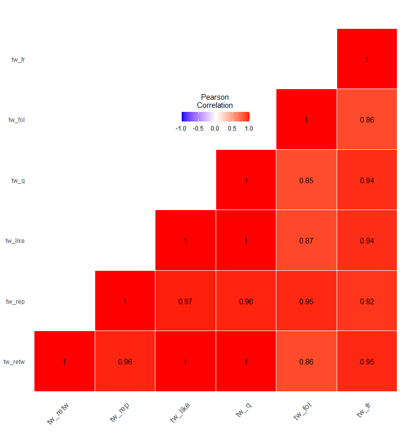
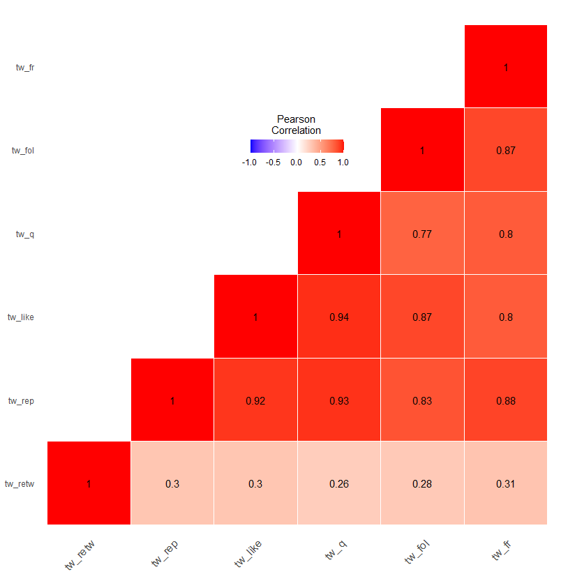
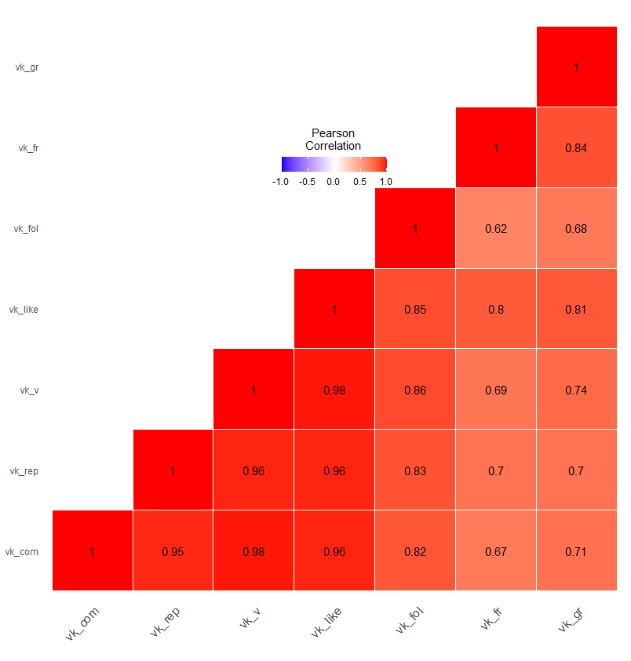
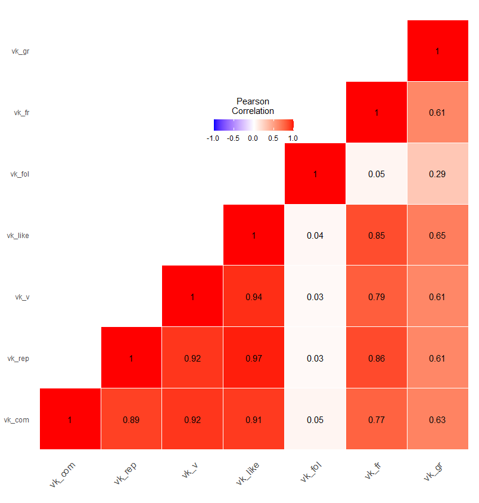

# Merging the datasets


```r
#Loading the dataset with the information extracted 
#for the ROI petition-signing
roi<-read.csv("dataset_roi.csv")
roi<-roi[,c("ID",
            "votes",
            "main_topic")]
#Dataset containing the information about 
#the Change.org petition-signing
ch<-read.csv("dataset_ch.csv")
ch<-ch[,c("ID",
          "Number.of.signatures",
          "main_topic")]

#Datasets in regard to mobilisation on Twitter
#ROI petition-mentioning
tw_roi<-read.csv("twitter_roi.csv")
#subsetting the dataset
tw_roi<-tw_roi[,c("ID",
                  "Retweet",
                  "Reply",
                  "Likes",
                  "Quote",
                  "Followers",
                  "Friends")]
#Change.org petition-mentioning
tw_ch<-read.csv("twitter_ch.csv")
tw_ch<-tw_ch[,c("ID",
                "Retweet",
                "Reply",
                "Likes",
                "Quote",
                "Followers",
                "Friends")]

#Datasets in regard to mobilisation on VK
#ROI petition-mentioning
vk_roi<-read.csv("vk_roi.csv")
vk_roi<-vk_roi[,c("ID",
                  "Comment",
                  "Repost",
                  "View",
                  "Like",
                  "Followers",
                  "Friends",
                  "Groups")]
#Change.org petition-mentioning
vk_ch<-read.csv("vk_ch.csv")
vk_ch<-vk_ch[,c("ID",
                "Comment",
                "Repost",
                "View",
                "Like",
                "Followers",
                "Friends",
                "Groups")]
```


```r
#Aggregating the data in the mobilisation datasets
#Summing up the number of mentions, views, etc.
#install.packages("dplyr",dependencies=T)
library(dplyr)

tw_roi<-tw_roi %>% 
  group_by(ID)%>%
  summarize(tw_retw=sum(Retweet,na.rm = T),
            tw_rep=sum(Reply,na.rm = T),
            tw_like=sum(Likes,na.rm = T),
            tw_q=sum(Quote,na.rm = T),
            tw_fol=sum(Followers,na.rm = T),
            tw_fr=sum(Friends,na.rm = T))
tw_ch<-tw_ch %>% 
  group_by(ID)%>%
  summarize(tw_retw=sum(Retweet,na.rm = T),
            tw_rep=sum(Reply,na.rm = T),
            tw_like=sum(Likes,na.rm = T),
            tw_q=sum(Quote,na.rm = T),
            tw_fol=sum(Followers,na.rm = T),
            tw_fr=sum(Friends,na.rm = T))
vk_roi<-vk_roi %>% 
  group_by(ID)%>%
  summarize(vk_com=sum(Comment,na.rm = T),
            vk_rep=sum(Repost,na.rm = T),
            vk_v=sum(View,na.rm = T),
            vk_like=sum(Like,na.rm = T),
            vk_fol=sum(Followers,na.rm = T),
            vk_fr=sum(Friends,na.rm = T),
            vk_gr=sum(Groups,na.rm = T))
vk_ch<-vk_ch %>% 
  group_by(ID)%>%
  summarize(vk_com=sum(Comment,na.rm = T),
            vk_rep=sum(Repost,na.rm = T),
            vk_v=sum(View,na.rm = T),
            vk_like=sum(Like,na.rm = T),
            vk_fol=sum(Followers,na.rm = T),
            vk_fr=sum(Friends,na.rm = T),
            vk_gr=sum(Groups,na.rm = T))
```


```r
#Merging the datasets
roi<-left_join(roi,tw_roi)
roi<-left_join(roi,vk_roi)

ch<-left_join(ch,tw_ch)
ch<-left_join(ch,vk_ch)

#If the petition was not mentiones on SNSs, then the number of 
#mentions, views, etc. is 0
for (i in 4:length(names(roi))){
  roi[,names(roi)[i]]<-ifelse(is.na(roi[,names(roi)[i]]),0,
                              roi[,names(roi)[i]])}

for (i in 4:length(names(ch))){
  ch[,names(ch)[i]]<-ifelse(is.na(ch[,names(ch)[i]]),0,
                              ch[,names(ch)[i]])}
```

# Dimensionality reduction


```r
#Examining if some of the variables correlate
#Checking the Twitter variables
#In the ROI dataset
cor(roi[,c("tw_retw",
                "tw_rep",
                "tw_like",
                "tw_q",
                "tw_fol",
                "tw_fr")])
```




```r
#In the Change.org dataset
cor(ch[,c("tw_retw",
                "tw_rep",
                "tw_like",
                "tw_q",
                "tw_fol",
                "tw_fr")])
```



All of the variables are highly correlated. In this analysis, however, the distinction between the variables should be drawn. Thus, quotes and replies are reduced to one variable, i.e., petition-mentioning, while the number of friends and followers comprise the reach of the Twitter recruiters.


```r
# Confirmatory factor analysis
library(psych)
ch_tw_rep_q<-fa(as.matrix(ch[,c("tw_q","tw_rep")]),
           nfactors =1, 
           residuals = TRUE )

ch_tw_reach<-fa(as.matrix(ch[,c("tw_fr","tw_fol")]),
              nfactors =1, 
              residuals = TRUE )

roi_tw_rep_q<-fa(as.matrix(roi[,c("tw_q","tw_rep")]),
                nfactors =1, 
                residuals = TRUE )
roi_tw_reach<-fa(as.matrix(roi[,c("tw_fr","tw_fol")]),
                nfactors =1, 
                residuals = TRUE )

#loadings can be checked 
#loadings(roi_tw_reach)
#summary(roi_tw_reach$scores)
```


```r
#Checking the VK variables
#In the Change.org dataset
cor(roi[,c("vk_com",
           "vk_rep",
           "vk_v",
           "vk_like",
           "vk_fol",
           "vk_fr",
           "vk_gr")])
```




```r
#In the Change.org dataset
cor(ch[,c("vk_com",
           "vk_rep",
           "vk_v",
           "vk_like",
           "vk_fol",
           "vk_fr",
           "vk_gr")])
```


Once again, many variables are correlated. The dimensionality is reduced as follows. Comments and replies are reduced to the petition-mentioning, while number of friends, followers, groups and, in regard to the ROI petition-mentioning, views comprise the reach of the VK recruiters.


```r
roi_vk_com_rep<-fa(as.matrix(roi[,c("vk_com","vk_rep")]),
                 nfactors =1, 
                 residuals = TRUE )
ch_vk_com_rep<-fa(as.matrix(ch[,c("vk_com","vk_rep")]),
                   nfactors =1, 
                   residuals = TRUE )

roi_vk_reach<-fa(as.matrix(roi[,c("vk_v",
                                "vk_fol",
                                "vk_fr",
                                "vk_gr")]),
                   nfactors =1, 
                   residuals = TRUE )
ch_vk_reach<-fa(as.matrix(ch[,c("vk_v",
                                "vk_fr",
                                "vk_gr")]),
                 nfactors =1, 
                 residuals = TRUE )
```

```r
#Adding new variables to the df
ch$tw_rep_q<-ch_tw_rep_q$scores
ch$tw_reach<-ch_tw_reach$scores
ch$vk_com_rep<-ch_vk_com_rep$scores
ch$vk_reach<-ch_vk_reach$scores

roi$tw_rep_q<-roi_tw_rep_q$scores
roi$tw_reach<-roi_tw_reach$scores
roi$vk_com_rep<-roi_vk_com_rep$scores
roi$vk_reach<-roi_vk_reach$scores
```

# Regression analysis


```r
#There are outliers in the data
#Thus, subsetting the dataset to 96% of the variation
names_var<-c("tw_rep_q",
             "tw_like",
             "tw_retw",
             "tw_reach",
             "vk_com_rep",
             "vk_like",
             "vk_reach")
for (i in names_var){
  print(summary(lm(Number.of.signatures~
              main_topic*scale(get(i)),
              ch[ch$Number.of.signatures<
                   quantile(ch$Number.of.signatures,0.96),])))
}
```


```
## 
## Call:
## lm(formula = Number.of.signatures ~ main_topic * scale(get(i)), 
##     data = ch[ch$Number.of.signatures < quantile(ch$Number.of.signatures, 
##         0.96), ])
## 
## Residuals:
##     Min      1Q  Median      3Q     Max 
## -3060.3  -469.2  -262.6   -29.2  6900.0 
## 
## Coefficients:
##                                                Estimate Std. Error t value
## (Intercept)                                     548.023     76.756   7.140
## main_topicHealth                               -193.166    114.192  -1.692
## main_topicIdentity                             -223.848    105.944  -2.113
## main_topicInfrastructure_ecology               -216.875    105.958  -2.047
## main_topicInfrastructure_housing                155.962    103.464   1.507
## main_topicInfrastructure_roads                  260.245    122.268   2.128
## main_topicLegislature                          -181.066    127.284  -1.423
## main_topicNavalny                                 2.306    110.783   0.021
## main_topicPets                                  206.629    110.034   1.878
## scale(get(i))                                   186.624    101.714   1.835
## main_topicHealth:scale(get(i))                 -179.136    114.004  -1.571
## main_topicIdentity:scale(get(i))                536.529    157.316   3.411
## main_topicInfrastructure_ecology:scale(get(i))  195.986    197.884   0.990
## main_topicInfrastructure_housing:scale(get(i))   72.493    133.201   0.544
## main_topicInfrastructure_roads:scale(get(i))   1678.004    484.544   3.463
## main_topicLegislature:scale(get(i))             -53.918    255.300  -0.211
## main_topicNavalny:scale(get(i))                  32.363    110.002   0.294
## main_topicPets:scale(get(i))                    570.296    129.434   4.406
##                                                Pr(>|t|)    
## (Intercept)                                    1.45e-12 ***
## main_topicHealth                               0.090932 .  
## main_topicIdentity                             0.034775 *  
## main_topicInfrastructure_ecology               0.040852 *  
## main_topicInfrastructure_housing               0.131917    
## main_topicInfrastructure_roads                 0.033460 *  
## main_topicLegislature                          0.155078    
## main_topicNavalny                              0.983393    
## main_topicPets                                 0.060594 .  
## scale(get(i))                                  0.066736 .  
## main_topicHealth:scale(get(i))                 0.116321    
## main_topicIdentity:scale(get(i))               0.000666 ***
## main_topicInfrastructure_ecology:scale(get(i)) 0.322134    
## main_topicInfrastructure_housing:scale(get(i)) 0.586361    
## main_topicInfrastructure_roads:scale(get(i))   0.000549 ***
## main_topicLegislature:scale(get(i))            0.832764    
## main_topicNavalny:scale(get(i))                0.768646    
## main_topicPets:scale(get(i))                   1.13e-05 ***
## ---
## Signif. codes:  0 '***' 0.001 '**' 0.01 '*' 0.05 '.' 0.1 ' ' 1
## 
## Residual standard error: 1014 on 1497 degrees of freedom
## Multiple R-squared:  0.1364,	Adjusted R-squared:  0.1266 
## F-statistic: 13.91 on 17 and 1497 DF,  p-value: < 2.2e-16
## 
## 
## Call:
## lm(formula = Number.of.signatures ~ main_topic * scale(get(i)), 
##     data = ch[ch$Number.of.signatures < quantile(ch$Number.of.signatures, 
##         0.96), ])
## 
## Residuals:
##     Min      1Q  Median      3Q     Max 
## -2151.6  -484.3  -272.7   -41.9  6899.6 
## 
## Coefficients:
##                                                Estimate Std. Error t value
## (Intercept)                                      542.73      78.23   6.937
## main_topicHealth                                -189.81     116.53  -1.629
## main_topicIdentity                              -205.78     108.07  -1.904
## main_topicInfrastructure_ecology                -222.35     108.30  -2.053
## main_topicInfrastructure_housing                 174.80     105.64   1.655
## main_topicInfrastructure_roads                   539.81     147.43   3.661
## main_topicLegislature                            -57.81     145.30  -0.398
## main_topicNavalny                                  3.67     112.97   0.032
## main_topicPets                                   319.07     111.59   2.859
## scale(get(i))                                     32.86     124.39   0.264
## main_topicHealth:scale(get(i))                   -15.21     131.93  -0.115
## main_topicIdentity:scale(get(i))                 703.40     263.67   2.668
## main_topicInfrastructure_ecology:scale(get(i))   261.27     296.00   0.883
## main_topicInfrastructure_housing:scale(get(i))   522.00     219.63   2.377
## main_topicInfrastructure_roads:scale(get(i))    5972.92    1201.12   4.973
## main_topicLegislature:scale(get(i))             1886.81    1026.91   1.837
## main_topicNavalny:scale(get(i))                  159.19     129.87   1.226
## main_topicPets:scale(get(i))                    1022.44     199.17   5.133
##                                                Pr(>|t|)    
## (Intercept)                                    5.92e-12 ***
## main_topicHealth                                0.10354    
## main_topicIdentity                              0.05708 .  
## main_topicInfrastructure_ecology                0.04023 *  
## main_topicInfrastructure_housing                0.09821 .  
## main_topicInfrastructure_roads                  0.00026 ***
## main_topicLegislature                           0.69081    
## main_topicNavalny                               0.97409    
## main_topicPets                                  0.00430 ** 
## scale(get(i))                                   0.79171    
## main_topicHealth:scale(get(i))                  0.90821    
## main_topicIdentity:scale(get(i))                0.00772 ** 
## main_topicInfrastructure_ecology:scale(get(i))  0.37757    
## main_topicInfrastructure_housing:scale(get(i))  0.01759 *  
## main_topicInfrastructure_roads:scale(get(i))   7.36e-07 ***
## main_topicLegislature:scale(get(i))             0.06635 .  
## main_topicNavalny:scale(get(i))                 0.22048    
## main_topicPets:scale(get(i))                   3.22e-07 ***
## ---
## Signif. codes:  0 '***' 0.001 '**' 0.01 '*' 0.05 '.' 0.1 ' ' 1
## 
## Residual standard error: 1034 on 1497 degrees of freedom
## Multiple R-squared:  0.1021,	Adjusted R-squared:  0.09192 
## F-statistic: 10.02 on 17 and 1497 DF,  p-value: < 2.2e-16
## 
## 
## Call:
## lm(formula = Number.of.signatures ~ main_topic * scale(get(i)), 
##     data = ch[ch$Number.of.signatures < quantile(ch$Number.of.signatures, 
##         0.96), ])
## 
## Residuals:
##     Min      1Q  Median      3Q     Max 
## -3130.8  -473.2  -276.7   -33.0  6891.1 
## 
## Coefficients:
##                                                Estimate Std. Error t value
## (Intercept)                                     602.851     88.442   6.816
## main_topicHealth                               -220.871    124.414  -1.775
## main_topicIdentity                             -293.484    114.723  -2.558
## main_topicInfrastructure_ecology               -300.695    114.108  -2.635
## main_topicInfrastructure_housing                137.094    114.027   1.202
## main_topicInfrastructure_roads                  656.209    216.589   3.030
## main_topicLegislature                          -279.461    134.076  -2.084
## main_topicNavalny                                -4.903    119.099  -0.041
## main_topicPets                                  309.901    118.046   2.625
## scale(get(i))                                  1063.342    771.833   1.378
## main_topicHealth:scale(get(i))                 -483.809    912.978  -0.530
## main_topicIdentity:scale(get(i))               -690.456    775.923  -0.890
## main_topicInfrastructure_ecology:scale(get(i)) -961.139    776.393  -1.238
## main_topicInfrastructure_housing:scale(get(i)) -120.662    885.788  -0.136
## main_topicInfrastructure_roads:scale(get(i))   8893.252   2873.366   3.095
## main_topicLegislature:scale(get(i))            -939.263    772.411  -1.216
## main_topicNavalny:scale(get(i))                  28.252    799.168   0.035
## main_topicPets:scale(get(i))                   2724.272    861.274   3.163
##                                                Pr(>|t|)    
## (Intercept)                                    1.35e-11 ***
## main_topicHealth                                0.07605 .  
## main_topicIdentity                              0.01062 *  
## main_topicInfrastructure_ecology                0.00850 ** 
## main_topicInfrastructure_housing                0.22944    
## main_topicInfrastructure_roads                  0.00249 ** 
## main_topicLegislature                           0.03730 *  
## main_topicNavalny                               0.96717    
## main_topicPets                                  0.00875 ** 
## scale(get(i))                                   0.16851    
## main_topicHealth:scale(get(i))                  0.59624    
## main_topicIdentity:scale(get(i))                0.37369    
## main_topicInfrastructure_ecology:scale(get(i))  0.21593    
## main_topicInfrastructure_housing:scale(get(i))  0.89167    
## main_topicInfrastructure_roads:scale(get(i))    0.00200 ** 
## main_topicLegislature:scale(get(i))             0.22417    
## main_topicNavalny:scale(get(i))                 0.97180    
## main_topicPets:scale(get(i))                    0.00159 ** 
## ---
## Signif. codes:  0 '***' 0.001 '**' 0.01 '*' 0.05 '.' 0.1 ' ' 1
## 
## Residual standard error: 1014 on 1497 degrees of freedom
## Multiple R-squared:  0.137,	Adjusted R-squared:  0.1272 
## F-statistic: 13.98 on 17 and 1497 DF,  p-value: < 2.2e-16
## 
## 
## Call:
## lm(formula = Number.of.signatures ~ main_topic * scale(get(i)), 
##     data = ch[ch$Number.of.signatures < quantile(ch$Number.of.signatures, 
##         0.96), ])
## 
## Residuals:
##     Min      1Q  Median      3Q     Max 
## -3296.6  -392.6  -234.6   -28.2  6736.3 
## 
## Coefficients:
##                                                Estimate Std. Error t value
## (Intercept)                                       901.7      112.2   8.034
## main_topicHealth                                 -513.0      140.6  -3.650
## main_topicIdentity                               -565.6      131.7  -4.293
## main_topicInfrastructure_ecology                 -555.3      131.8  -4.212
## main_topicInfrastructure_housing                 -152.7      130.4  -1.171
## main_topicInfrastructure_roads                    736.3      193.3   3.809
## main_topicLegislature                            -530.3      147.0  -3.608
## main_topicNavalny                                -340.0      135.2  -2.515
## main_topicPets                                   -366.6      136.4  -2.688
## scale(get(i))                                    2019.7      481.6   4.194
## main_topicHealth:scale(get(i))                  -1765.9      525.9  -3.358
## main_topicIdentity:scale(get(i))                -1487.0      489.1  -3.040
## main_topicInfrastructure_ecology:scale(get(i))  -1591.3      497.7  -3.198
## main_topicInfrastructure_housing:scale(get(i))  -1465.0      494.6  -2.962
## main_topicInfrastructure_roads:scale(get(i))     3817.2      918.2   4.157
## main_topicLegislature:scale(get(i))             -1618.1      491.8  -3.290
## main_topicNavalny:scale(get(i))                 -1646.2      485.0  -3.394
## main_topicPets:scale(get(i))                    -1550.7      482.8  -3.212
##                                                Pr(>|t|)    
## (Intercept)                                    1.89e-15 ***
## main_topicHealth                               0.000271 ***
## main_topicIdentity                             1.87e-05 ***
## main_topicInfrastructure_ecology               2.68e-05 ***
## main_topicInfrastructure_housing               0.241633    
## main_topicInfrastructure_roads                 0.000145 ***
## main_topicLegislature                          0.000319 ***
## main_topicNavalny                              0.011996 *  
## main_topicPets                                 0.007265 ** 
## scale(get(i))                                  2.90e-05 ***
## main_topicHealth:scale(get(i))                 0.000806 ***
## main_topicIdentity:scale(get(i))               0.002403 ** 
## main_topicInfrastructure_ecology:scale(get(i)) 0.001414 ** 
## main_topicInfrastructure_housing:scale(get(i)) 0.003105 ** 
## main_topicInfrastructure_roads:scale(get(i))   3.40e-05 ***
## main_topicLegislature:scale(get(i))            0.001024 ** 
## main_topicNavalny:scale(get(i))                0.000706 ***
## main_topicPets:scale(get(i))                   0.001347 ** 
## ---
## Signif. codes:  0 '***' 0.001 '**' 0.01 '*' 0.05 '.' 0.1 ' ' 1
## 
## Residual standard error: 957.9 on 1497 degrees of freedom
## Multiple R-squared:   0.23,	Adjusted R-squared:  0.2213 
## F-statistic: 26.31 on 17 and 1497 DF,  p-value: < 2.2e-16
## 
## 
## Call:
## lm(formula = Number.of.signatures ~ main_topic * scale(get(i)), 
##     data = ch[ch$Number.of.signatures < quantile(ch$Number.of.signatures, 
##         0.96), ])
## 
## Residuals:
##     Min      1Q  Median      3Q     Max 
## -2696.8  -477.0  -266.2   -53.8  6904.9 
## 
## Coefficients:
##                                                Estimate Std. Error t value
## (Intercept)                                      602.64      86.04   7.004
## main_topicHealth                                -247.65     122.20  -2.027
## main_topicIdentity                              -242.25     114.91  -2.108
## main_topicInfrastructure_ecology                -269.45     113.74  -2.369
## main_topicInfrastructure_housing                  82.43     111.86   0.737
## main_topicInfrastructure_roads                   -27.84     119.74  -0.233
## main_topicLegislature                           -245.34     134.29  -1.827
## main_topicNavalny                                -35.08     118.83  -0.295
## main_topicPets                                   274.87     117.59   2.338
## scale(get(i))                                    441.75     253.40   1.743
## main_topicHealth:scale(get(i))                  -264.50     269.57  -0.981
## main_topicIdentity:scale(get(i))                 -84.24     287.22  -0.293
## main_topicInfrastructure_ecology:scale(get(i))   -36.99     275.53  -0.134
## main_topicInfrastructure_housing:scale(get(i))  -329.05     259.84  -1.266
## main_topicInfrastructure_roads:scale(get(i))    -219.63     259.13  -0.848
## main_topicLegislature:scale(get(i))             -125.50     266.67  -0.471
## main_topicNavalny:scale(get(i))                 -299.05     261.88  -1.142
## main_topicPets:scale(get(i))                     160.46     274.12   0.585
##                                                Pr(>|t|)    
## (Intercept)                                    3.74e-12 ***
## main_topicHealth                                 0.0429 *  
## main_topicIdentity                               0.0352 *  
## main_topicInfrastructure_ecology                 0.0180 *  
## main_topicInfrastructure_housing                 0.4613    
## main_topicInfrastructure_roads                   0.8162    
## main_topicLegislature                            0.0679 .  
## main_topicNavalny                                0.7679    
## main_topicPets                                   0.0195 *  
## scale(get(i))                                    0.0815 .  
## main_topicHealth:scale(get(i))                   0.3267    
## main_topicIdentity:scale(get(i))                 0.7693    
## main_topicInfrastructure_ecology:scale(get(i))   0.8932    
## main_topicInfrastructure_housing:scale(get(i))   0.2056    
## main_topicInfrastructure_roads:scale(get(i))     0.3968    
## main_topicLegislature:scale(get(i))              0.6380    
## main_topicNavalny:scale(get(i))                  0.2537    
## main_topicPets:scale(get(i))                     0.5584    
## ---
## Signif. codes:  0 '***' 0.001 '**' 0.01 '*' 0.05 '.' 0.1 ' ' 1
## 
## Residual standard error: 1041 on 1497 degrees of freedom
## Multiple R-squared:  0.09008,	Adjusted R-squared:  0.07974 
## F-statistic: 8.717 on 17 and 1497 DF,  p-value: < 2.2e-16
## 
## 
## Call:
## lm(formula = Number.of.signatures ~ main_topic * scale(get(i)), 
##     data = ch[ch$Number.of.signatures < quantile(ch$Number.of.signatures, 
##         0.96), ])
## 
## Residuals:
##     Min      1Q  Median      3Q     Max 
## -3223.6  -448.0  -247.6   -50.5  6908.5 
## 
## Coefficients:
##                                                 Estimate Std. Error t value
## (Intercept)                                      692.775     88.638   7.816
## main_topicHealth                                -336.151    123.578  -2.720
## main_topicIdentity                              -333.969    116.015  -2.879
## main_topicInfrastructure_ecology                -347.200    115.618  -3.003
## main_topicInfrastructure_housing                  -9.303    113.549  -0.082
## main_topicInfrastructure_roads                  -102.703    120.962  -0.849
## main_topicLegislature                           -321.350    135.398  -2.373
## main_topicNavalny                               -134.281    120.438  -1.115
## main_topicPets                                   188.216    119.123   1.580
## scale(get(i))                                   1161.980    323.127   3.596
## main_topicHealth:scale(get(i))                  -975.372    333.836  -2.922
## main_topicIdentity:scale(get(i))                -663.018    345.765  -1.918
## main_topicInfrastructure_ecology:scale(get(i))  -624.511    353.427  -1.767
## main_topicInfrastructure_housing:scale(get(i)) -1029.000    329.234  -3.125
## main_topicInfrastructure_roads:scale(get(i))    -789.713    332.838  -2.373
## main_topicLegislature:scale(get(i))             -724.378    338.192  -2.142
## main_topicNavalny:scale(get(i))                -1052.627    325.879  -3.230
## main_topicPets:scale(get(i))                    -563.763    344.385  -1.637
##                                                Pr(>|t|)    
## (Intercept)                                    1.02e-14 ***
## main_topicHealth                               0.006601 ** 
## main_topicIdentity                             0.004050 ** 
## main_topicInfrastructure_ecology               0.002718 ** 
## main_topicInfrastructure_housing               0.934717    
## main_topicInfrastructure_roads                 0.395988    
## main_topicLegislature                          0.017752 *  
## main_topicNavalny                              0.265053    
## main_topicPets                                 0.114317    
## scale(get(i))                                  0.000334 ***
## main_topicHealth:scale(get(i))                 0.003533 ** 
## main_topicIdentity:scale(get(i))               0.055360 .  
## main_topicInfrastructure_ecology:scale(get(i)) 0.077429 .  
## main_topicInfrastructure_housing:scale(get(i)) 0.001810 ** 
## main_topicInfrastructure_roads:scale(get(i))   0.017786 *  
## main_topicLegislature:scale(get(i))            0.032361 *  
## main_topicNavalny:scale(get(i))                0.001264 ** 
## main_topicPets:scale(get(i))                   0.101838    
## ---
## Signif. codes:  0 '***' 0.001 '**' 0.01 '*' 0.05 '.' 0.1 ' ' 1
## 
## Residual standard error: 1033 on 1497 degrees of freedom
## Multiple R-squared:  0.1041,	Adjusted R-squared:  0.09391 
## F-statistic: 10.23 on 17 and 1497 DF,  p-value: < 2.2e-16
## 
## 
## Call:
## lm(formula = Number.of.signatures ~ main_topic * scale(get(i)), 
##     data = ch[ch$Number.of.signatures < quantile(ch$Number.of.signatures, 
##         0.96), ])
## 
## Residuals:
##     Min      1Q  Median      3Q     Max 
## -4028.1  -416.5  -217.7   -50.4  6934.8 
## 
## Coefficients:
##                                                Estimate Std. Error t value
## (Intercept)                                     655.908     80.530   8.145
## main_topicHealth                               -274.916    117.081  -2.348
## main_topicIdentity                             -292.009    108.964  -2.680
## main_topicInfrastructure_ecology               -340.075    108.106  -3.146
## main_topicInfrastructure_housing                  8.488    106.819   0.079
## main_topicInfrastructure_roads                  -80.684    114.156  -0.707
## main_topicLegislature                          -242.605    129.192  -1.878
## main_topicNavalny                               -95.311    113.406  -0.840
## main_topicPets                                  248.909    112.475   2.213
## scale(get(i))                                   914.066    197.621   4.625
## main_topicHealth:scale(get(i))                 -574.768    228.757  -2.513
## main_topicIdentity:scale(get(i))               -370.292    223.652  -1.656
## main_topicInfrastructure_ecology:scale(get(i)) -603.788    208.083  -2.902
## main_topicInfrastructure_housing:scale(get(i)) -764.946    203.390  -3.761
## main_topicInfrastructure_roads:scale(get(i))   -534.271    207.916  -2.570
## main_topicLegislature:scale(get(i))            -210.720    241.971  -0.871
## main_topicNavalny:scale(get(i))                -678.100    208.482  -3.253
## main_topicPets:scale(get(i))                   -336.511    228.914  -1.470
##                                                Pr(>|t|)    
## (Intercept)                                    7.92e-16 ***
## main_topicHealth                               0.019000 *  
## main_topicIdentity                             0.007446 ** 
## main_topicInfrastructure_ecology               0.001689 ** 
## main_topicInfrastructure_housing               0.936679    
## main_topicInfrastructure_roads                 0.479811    
## main_topicLegislature                          0.060593 .  
## main_topicNavalny                              0.400791    
## main_topicPets                                 0.027047 *  
## scale(get(i))                                  4.06e-06 ***
## main_topicHealth:scale(get(i))                 0.012090 *  
## main_topicIdentity:scale(get(i))               0.098000 .  
## main_topicInfrastructure_ecology:scale(get(i)) 0.003766 ** 
## main_topicInfrastructure_housing:scale(get(i)) 0.000176 ***
## main_topicInfrastructure_roads:scale(get(i))   0.010276 *  
## main_topicLegislature:scale(get(i))            0.383977    
## main_topicNavalny:scale(get(i))                0.001169 ** 
## main_topicPets:scale(get(i))                   0.141763    
## ---
## Signif. codes:  0 '***' 0.001 '**' 0.01 '*' 0.05 '.' 0.1 ' ' 1
## 
## Residual standard error: 1014 on 1497 degrees of freedom
## Multiple R-squared:  0.1366,	Adjusted R-squared:  0.1268 
## F-statistic: 13.93 on 17 and 1497 DF,  p-value: < 2.2e-16
```


```r
for (i in names_var){
  print(summary(lm(votes~
              main_topic*scale(get(i)),
              roi[roi$votes<
                   quantile(roi$votes,0.96),])))
}
```


```
## 
## Call:
## lm(formula = votes ~ main_topic * scale(get(i)), data = roi[roi$votes < 
##     quantile(roi$votes, 0.96), ])
## 
## Residuals:
##     Min      1Q  Median      3Q     Max 
## -485.56 -241.34  -25.56  186.72 1089.17 
## 
## Coefficients: (3 not defined because of singularities)
##                                        Estimate Std. Error t value Pr(>|t|)    
## (Intercept)                              442.04      30.99  14.265  < 2e-16 ***
## main_topicInfrastructure                -127.24      38.23  -3.328 0.000936 ***
## main_topicLaw_criminal                  -206.33      59.24  -3.483 0.000538 ***
## main_topicLaw_weapon                     -24.37      45.39  -0.537 0.591551    
## main_topicSocial_support                  65.73      33.99   1.934 0.053677 .  
## scale(get(i))                            291.74     270.06   1.080 0.280525    
## main_topicInfrastructure:scale(get(i))  -260.01     270.35  -0.962 0.336622    
## main_topicLaw_criminal:scale(get(i))         NA         NA      NA       NA    
## main_topicLaw_weapon:scale(get(i))           NA         NA      NA       NA    
## main_topicSocial_support:scale(get(i))       NA         NA      NA       NA    
## ---
## Signif. codes:  0 '***' 0.001 '**' 0.01 '*' 0.05 '.' 0.1 ' ' 1
## 
## Residual standard error: 284.9 on 523 degrees of freedom
## Multiple R-squared:  0.08267,	Adjusted R-squared:  0.07215 
## F-statistic: 7.856 on 6 and 523 DF,  p-value: 4.076e-08
## 
## 
## Call:
## lm(formula = votes ~ main_topic * scale(get(i)), data = roi[roi$votes < 
##     quantile(roi$votes, 0.96), ])
## 
## Residuals:
##     Min      1Q  Median      3Q     Max 
## -524.88 -240.20  -25.39  181.91  962.39 
## 
## Coefficients: (1 not defined because of singularities)
##                                        Estimate Std. Error t value Pr(>|t|)    
## (Intercept)                              561.88      35.27  15.930  < 2e-16 ***
## main_topicInfrastructure                -246.84      41.48  -5.951 4.88e-09 ***
## main_topicLaw_criminal                  -181.11      57.93  -3.126  0.00187 ** 
## main_topicLaw_weapon                     -26.73     129.74  -0.206  0.83687    
## main_topicSocial_support                 -72.22      47.78  -1.511  0.13131    
## scale(get(i))                           2387.10     439.29   5.434 8.48e-08 ***
## main_topicInfrastructure:scale(get(i)) -2355.33     439.46  -5.360 1.26e-07 ***
## main_topicLaw_criminal:scale(get(i))         NA         NA      NA       NA    
## main_topicLaw_weapon:scale(get(i))      -398.34    1847.32  -0.216  0.82936    
## main_topicSocial_support:scale(get(i)) -2354.30     566.00  -4.160 3.73e-05 ***
## ---
## Signif. codes:  0 '***' 0.001 '**' 0.01 '*' 0.05 '.' 0.1 ' ' 1
## 
## Residual standard error: 277.7 on 521 degrees of freedom
## Multiple R-squared:  0.1319,	Adjusted R-squared:  0.1186 
## F-statistic: 9.898 on 8 and 521 DF,  p-value: 7.361e-13
## 
## 
## Call:
## lm(formula = votes ~ main_topic * scale(get(i)), data = roi[roi$votes < 
##     quantile(roi$votes, 0.96), ])
## 
## Residuals:
##     Min      1Q  Median      3Q     Max 
## -548.38 -238.82  -25.02  181.01 1095.23 
## 
## Coefficients: (1 not defined because of singularities)
##                                         Estimate Std. Error t value Pr(>|t|)
## (Intercept)                              513.703     50.336  10.205  < 2e-16
## main_topicInfrastructure                -198.030     55.106  -3.594 0.000357
## main_topicLaw_criminal                  -200.268     59.346  -3.375 0.000794
## main_topicLaw_weapon                      -3.157    117.888  -0.027 0.978649
## main_topicSocial_support                 -16.473     61.411  -0.268 0.788618
## scale(get(i))                           1224.516    584.456   2.095 0.036641
## main_topicInfrastructure:scale(get(i)) -1201.488    584.590  -2.055 0.040351
## main_topicLaw_criminal:scale(get(i))          NA         NA      NA       NA
## main_topicLaw_weapon:scale(get(i))       189.395   1434.052   0.132 0.894980
## main_topicSocial_support:scale(get(i)) -1091.394    687.667  -1.587 0.113098
##                                           
## (Intercept)                            ***
## main_topicInfrastructure               ***
## main_topicLaw_criminal                 ***
## main_topicLaw_weapon                      
## main_topicSocial_support                  
## scale(get(i))                          *  
## main_topicInfrastructure:scale(get(i)) *  
## main_topicLaw_criminal:scale(get(i))      
## main_topicLaw_weapon:scale(get(i))        
## main_topicSocial_support:scale(get(i))    
## ---
## Signif. codes:  0 '***' 0.001 '**' 0.01 '*' 0.05 '.' 0.1 ' ' 1
## 
## Residual standard error: 285.1 on 521 degrees of freedom
## Multiple R-squared:  0.08523,	Adjusted R-squared:  0.07118 
## F-statistic: 6.067 on 8 and 521 DF,  p-value: 1.769e-07
## 
## 
## Call:
## lm(formula = votes ~ main_topic * scale(get(i)), data = roi[roi$votes < 
##     quantile(roi$votes, 0.96), ])
## 
## Residuals:
##     Min      1Q  Median      3Q     Max 
## -470.94 -238.13  -15.59  173.62  975.35 
## 
## Coefficients:
##                                        Estimate Std. Error t value Pr(>|t|)    
## (Intercept)                             422.756     23.578  17.930  < 2e-16 ***
## main_topicInfrastructure               -107.635     31.793  -3.386 0.000764 ***
## main_topicLaw_criminal                  -98.537    105.669  -0.933 0.351508    
## main_topicLaw_weapon                      9.275     54.227   0.171 0.864261    
## main_topicSocial_support                 71.105     32.558   2.184 0.029414 *  
## scale(get(i))                           327.094     51.538   6.347 4.79e-10 ***
## main_topicInfrastructure:scale(get(i)) -278.957     52.999  -5.263 2.07e-07 ***
## main_topicLaw_criminal:scale(get(i))    640.175    795.930   0.804 0.421585    
## main_topicLaw_weapon:scale(get(i))      -37.885    331.577  -0.114 0.909078    
## main_topicSocial_support:scale(get(i)) -162.550     89.920  -1.808 0.071228 .  
## ---
## Signif. codes:  0 '***' 0.001 '**' 0.01 '*' 0.05 '.' 0.1 ' ' 1
## 
## Residual standard error: 271.9 on 520 degrees of freedom
## Multiple R-squared:  0.1694,	Adjusted R-squared:  0.155 
## F-statistic: 11.79 on 9 and 520 DF,  p-value: < 2.2e-16
## 
## 
## Call:
## lm(formula = votes ~ main_topic * scale(get(i)), data = roi[roi$votes < 
##     quantile(roi$votes, 0.96), ])
## 
## Residuals:
##     Min      1Q  Median      3Q     Max 
## -597.01 -238.03  -21.33  186.33 1101.74 
## 
## Coefficients: (1 not defined because of singularities)
##                                        Estimate Std. Error t value Pr(>|t|)    
## (Intercept)                              426.46      24.57  17.354  < 2e-16 ***
## main_topicInfrastructure                -112.43      33.16  -3.390 0.000752 ***
## main_topicLaw_criminal                  -193.76      58.96  -3.286 0.001084 ** 
## main_topicLaw_weapon                     -25.54      44.81  -0.570 0.568937    
## main_topicSocial_support                  79.93      36.88   2.167 0.030657 *  
## scale(get(i))                            103.06      36.49   2.824 0.004923 ** 
## main_topicInfrastructure:scale(get(i))   -70.93      38.96  -1.821 0.069237 .  
## main_topicLaw_criminal:scale(get(i))         NA         NA      NA       NA    
## main_topicLaw_weapon:scale(get(i))       -11.81      66.90  -0.176 0.859982    
## main_topicSocial_support:scale(get(i))    48.20     124.50   0.387 0.698830    
## ---
## Signif. codes:  0 '***' 0.001 '**' 0.01 '*' 0.05 '.' 0.1 ' ' 1
## 
## Residual standard error: 282.8 on 521 degrees of freedom
## Multiple R-squared:  0.09999,	Adjusted R-squared:  0.08617 
## F-statistic: 7.235 on 8 and 521 DF,  p-value: 4.04e-09
## 
## 
## Call:
## lm(formula = votes ~ main_topic * scale(get(i)), data = roi[roi$votes < 
##     quantile(roi$votes, 0.96), ])
## 
## Residuals:
##     Min      1Q  Median      3Q     Max 
## -613.13 -238.32  -19.93  185.84 1100.56 
## 
## Coefficients: (1 not defined because of singularities)
##                                        Estimate Std. Error t value Pr(>|t|)    
## (Intercept)                              419.53      24.49  17.131  < 2e-16 ***
## main_topicInfrastructure                -104.31      33.09  -3.152 0.001714 ** 
## main_topicLaw_criminal                  -194.94      58.80  -3.316 0.000978 ***
## main_topicLaw_weapon                     -16.90      44.70  -0.378 0.705566    
## main_topicSocial_support                 104.10      39.26   2.652 0.008252 ** 
## scale(get(i))                             53.43      15.65   3.414 0.000690 ***
## main_topicInfrastructure:scale(get(i))   -16.39      26.67  -0.614 0.539163    
## main_topicLaw_criminal:scale(get(i))         NA         NA      NA       NA    
## main_topicLaw_weapon:scale(get(i))        23.97      60.90   0.393 0.694114    
## main_topicSocial_support:scale(get(i))   212.52     149.50   1.422 0.155738    
## ---
## Signif. codes:  0 '***' 0.001 '**' 0.01 '*' 0.05 '.' 0.1 ' ' 1
## 
## Residual standard error: 282.3 on 521 degrees of freedom
## Multiple R-squared:  0.1029,	Adjusted R-squared:  0.08911 
## F-statistic: 7.469 on 8 and 521 DF,  p-value: 1.893e-09
## 
## 
## Call:
## lm(formula = votes ~ main_topic * scale(get(i)), data = roi[roi$votes < 
##     quantile(roi$votes, 0.96), ])
## 
## Residuals:
##     Min      1Q  Median      3Q     Max 
## -617.14 -237.84  -24.67  183.59 1101.25 
## 
## Coefficients: (1 not defined because of singularities)
##                                        Estimate Std. Error t value Pr(>|t|)    
## (Intercept)                              417.37      24.51  17.025  < 2e-16 ***
## main_topicInfrastructure                -100.17      33.04  -3.032 0.002548 ** 
## main_topicLaw_criminal                  -194.25      58.81  -3.303 0.001021 ** 
## main_topicLaw_weapon                     -11.40      44.76  -0.255 0.799097    
## main_topicSocial_support                  87.25      36.25   2.407 0.016427 *  
## scale(get(i))                             53.68      15.57   3.448 0.000611 ***
## main_topicInfrastructure:scale(get(i))   -12.89      26.09  -0.494 0.621326    
## main_topicLaw_criminal:scale(get(i))         NA         NA      NA       NA    
## main_topicLaw_weapon:scale(get(i))        77.96      90.04   0.866 0.387025    
## main_topicSocial_support:scale(get(i))   114.04     132.14   0.863 0.388546    
## ---
## Signif. codes:  0 '***' 0.001 '**' 0.01 '*' 0.05 '.' 0.1 ' ' 1
## 
## Residual standard error: 282.3 on 521 degrees of freedom
## Multiple R-squared:  0.1029,	Adjusted R-squared:  0.0891 
## F-statistic: 7.468 on 8 and 521 DF,  p-value: 1.9e-09
```


```r
#Checking the influence of the topic alone
summary(lm(Number.of.signatures~
              main_topic,
              ch[ch$Number.of.signatures<
                   quantile(ch$Number.of.signatures,0.96),]))

summary(lm(votes~
              main_topic,
              roi[roi$votes<
                   quantile(roi$votes,0.96),]))
```


```
## 
## Call:
## lm(formula = Number.of.signatures ~ main_topic, data = ch[ch$Number.of.signatures < 
##     quantile(ch$Number.of.signatures, 0.96), ])
## 
## Residuals:
##    Min     1Q Median     3Q    Max 
## -855.8 -507.1 -302.7  -55.7 6867.0 
## 
## Coefficients:
##                                  Estimate Std. Error t value Pr(>|t|)    
## (Intercept)                        542.09      81.08   6.686 3.22e-11 ***
## main_topicHealth                  -187.08     120.68  -1.550  0.12130    
## main_topicIdentity                -217.39     111.96  -1.942  0.05236 .  
## main_topicInfrastructure_ecology  -237.39     111.28  -2.133  0.03307 *  
## main_topicInfrastructure_housing   155.89     109.31   1.426  0.15406    
## main_topicInfrastructure_roads      67.66     117.71   0.575  0.56553    
## main_topicLegislature             -183.53     133.61  -1.374  0.16977    
## main_topicNavalny                   36.10     116.94   0.309  0.75759    
## main_topicPets                     318.75     115.68   2.756  0.00593 ** 
## ---
## Signif. codes:  0 '***' 0.001 '**' 0.01 '*' 0.05 '.' 0.1 ' ' 1
## 
## Residual standard error: 1073 on 1506 degrees of freedom
## Multiple R-squared:  0.02883,	Adjusted R-squared:  0.02367 
## F-statistic: 5.588 on 8 and 1506 DF,  p-value: 5.346e-07
```

```
## 
## Call:
## lm(formula = votes ~ main_topic, data = roi[roi$votes < quantile(roi$votes, 
##     0.96), ])
## 
## Residuals:
##     Min      1Q  Median      3Q     Max 
## -485.56 -242.57  -25.56  185.96 1089.17 
## 
## Coefficients:
##                          Estimate Std. Error t value Pr(>|t|)    
## (Intercept)                421.83      24.84  16.983  < 2e-16 ***
## main_topicInfrastructure  -102.29      33.47  -3.056 0.002357 ** 
## main_topicLaw_criminal    -206.33      59.56  -3.464 0.000575 ***
## main_topicLaw_weapon       -18.92      45.35  -0.417 0.676666    
## main_topicSocial_support    65.73      34.17   1.923 0.054960 .  
## ---
## Signif. codes:  0 '***' 0.001 '**' 0.01 '*' 0.05 '.' 0.1 ' ' 1
## 
## Residual standard error: 286.5 on 525 degrees of freedom
## Multiple R-squared:  0.06926,	Adjusted R-squared:  0.06217 
## F-statistic: 9.767 on 4 and 525 DF,  p-value: 1.26e-07
```


```r
#Comparing the influence of the number of Twitter friends
#on the Change.org petition signing

summary(lm(Number.of.signatures~
              main_topic*tw_fr,
              ch[ch$Number.of.signatures<
                   quantile(ch$Number.of.signatures,0.96),]))

#and the number of VK friends
#on the Change.org petition signing
summary(lm(Number.of.signatures~
              main_topic*vk_fr,
              ch[ch$Number.of.signatures<
                   quantile(ch$Number.of.signatures,0.96),]))
```


```
## 
## Call:
## lm(formula = Number.of.signatures ~ main_topic * tw_fr, data = ch[ch$Number.of.signatures < 
##     quantile(ch$Number.of.signatures, 0.96), ])
## 
## Residuals:
##     Min      1Q  Median      3Q     Max 
## -3687.2  -363.3  -234.4   -24.2  6648.7 
## 
## Coefficients:
##                                          Estimate Std. Error t value Pr(>|t|)
## (Intercept)                             377.55344   73.87549   5.111 3.62e-07
## main_topicHealth                        -59.74203  109.31068  -0.547   0.5848
## main_topicIdentity                     -137.65147  100.88032  -1.365   0.1726
## main_topicInfrastructure_ecology       -119.97977  100.19433  -1.197   0.2313
## main_topicInfrastructure_housing        237.20795   98.58068   2.406   0.0162
## main_topicInfrastructure_roads            1.78452  108.35145   0.016   0.9869
## main_topicLegislature                   -90.26623  119.58832  -0.755   0.4505
## main_topicNavalny                       110.40663  105.10952   1.050   0.2937
## main_topicPets                           44.62777  107.75181   0.414   0.6788
## tw_fr                                     0.53752    0.07002   7.677 2.93e-14
## main_topicHealth:tw_fr                   -0.47566    0.07782  -6.113 1.25e-09
## main_topicIdentity:tw_fr                 -0.48023    0.07063  -6.800 1.51e-11
## main_topicInfrastructure_ecology:tw_fr   -0.49552    0.07094  -6.985 4.27e-12
## main_topicInfrastructure_housing:tw_fr   -0.45596    0.07120  -6.404 2.02e-10
## main_topicInfrastructure_roads:tw_fr      0.08256    0.10153   0.813   0.4163
## main_topicLegislature:tw_fr              -0.49771    0.07061  -7.048 2.75e-12
## main_topicNavalny:tw_fr                  -0.50185    0.07023  -7.146 1.39e-12
## main_topicPets:tw_fr                     -0.49122    0.07010  -7.008 3.65e-12
##                                           
## (Intercept)                            ***
## main_topicHealth                          
## main_topicIdentity                        
## main_topicInfrastructure_ecology          
## main_topicInfrastructure_housing       *  
## main_topicInfrastructure_roads            
## main_topicLegislature                     
## main_topicNavalny                         
## main_topicPets                            
## tw_fr                                  ***
## main_topicHealth:tw_fr                 ***
## main_topicIdentity:tw_fr               ***
## main_topicInfrastructure_ecology:tw_fr ***
## main_topicInfrastructure_housing:tw_fr ***
## main_topicInfrastructure_roads:tw_fr      
## main_topicLegislature:tw_fr            ***
## main_topicNavalny:tw_fr                ***
## main_topicPets:tw_fr                   ***
## ---
## Signif. codes:  0 '***' 0.001 '**' 0.01 '*' 0.05 '.' 0.1 ' ' 1
## 
## Residual standard error: 935.2 on 1497 degrees of freedom
## Multiple R-squared:  0.266,	Adjusted R-squared:  0.2577 
## F-statistic: 31.92 on 17 and 1497 DF,  p-value: < 2.2e-16
```

```
## 
## Call:
## lm(formula = Number.of.signatures ~ main_topic * vk_fr, data = ch[ch$Number.of.signatures < 
##     quantile(ch$Number.of.signatures, 0.96), ])
## 
## Residuals:
##     Min      1Q  Median      3Q     Max 
## -3047.5  -425.0  -242.4   -51.2  6948.0 
## 
## Coefficients:
##                                          Estimate Std. Error t value Pr(>|t|)
## (Intercept)                             4.259e+02  8.165e+01   5.216 2.09e-07
## main_topicHealth                       -1.300e+02  1.202e+02  -1.082 0.279515
## main_topicIdentity                     -1.765e+02  1.117e+02  -1.581 0.114200
## main_topicInfrastructure_ecology       -1.646e+02  1.111e+02  -1.481 0.138749
## main_topicInfrastructure_housing        1.675e+02  1.101e+02   1.522 0.128208
## main_topicInfrastructure_roads          1.040e+02  1.173e+02   0.886 0.375608
## main_topicLegislature                  -2.101e+02  1.334e+02  -1.575 0.115575
## main_topicNavalny                       9.076e+01  1.166e+02   0.779 0.436273
## main_topicPets                          3.841e+02  1.147e+02   3.348 0.000835
## vk_fr                                   2.992e-01  6.400e-02   4.674 3.21e-06
## main_topicHealth:vk_fr                 -1.391e-01  8.508e-02  -1.635 0.102237
## main_topicIdentity:vk_fr               -1.273e-01  7.587e-02  -1.677 0.093664
## main_topicInfrastructure_ecology:vk_fr -1.668e-01  8.463e-02  -1.971 0.048917
## main_topicInfrastructure_housing:vk_fr -2.038e-01  6.716e-02  -3.035 0.002444
## main_topicInfrastructure_roads:vk_fr   -1.782e-01  7.074e-02  -2.519 0.011859
## main_topicLegislature:vk_fr            -9.194e-03  8.492e-02  -0.108 0.913803
## main_topicNavalny:vk_fr                -2.279e-01  6.788e-02  -3.357 0.000807
## main_topicPets:vk_fr                   -2.154e-01  6.868e-02  -3.137 0.001742
##                                           
## (Intercept)                            ***
## main_topicHealth                          
## main_topicIdentity                        
## main_topicInfrastructure_ecology          
## main_topicInfrastructure_housing          
## main_topicInfrastructure_roads            
## main_topicLegislature                     
## main_topicNavalny                         
## main_topicPets                         ***
## vk_fr                                  ***
## main_topicHealth:vk_fr                    
## main_topicIdentity:vk_fr               .  
## main_topicInfrastructure_ecology:vk_fr *  
## main_topicInfrastructure_housing:vk_fr ** 
## main_topicInfrastructure_roads:vk_fr   *  
## main_topicLegislature:vk_fr               
## main_topicNavalny:vk_fr                ***
## main_topicPets:vk_fr                   ** 
## ---
## Signif. codes:  0 '***' 0.001 '**' 0.01 '*' 0.05 '.' 0.1 ' ' 1
## 
## Residual standard error: 1029 on 1497 degrees of freedom
## Multiple R-squared:  0.1117,	Adjusted R-squared:  0.1016 
## F-statistic: 11.07 on 17 and 1497 DF,  p-value: < 2.2e-16
```

# Bayesian network analysis
## Structure learning
Bayesian network structure learning includes 2 steps. The first step is to infer the structure using score-based and hybrid algorithms of structure learning. Here, 2 algorithms are used. Those are HC and H2PC. To learn the structure correctly all interactions between variables associates with the Twitter and VK mobilisation were excluded. Thus, interactions of the type tw_like -> vk_like or vk_reach -> tw_retw, etc. are excluded.


```r
#Reading the blacklist
blacklist<-read.csv("blacklist.csv",header = F)

#Subsetting the datasets
ch_bn<-ch[,c("Number.of.signatures",
             "main_topic",
             "tw_retw",
             "tw_rep_q",
             "tw_like",
             "tw_reach", 
             "vk_com_rep", 
             "vk_like",
             "vk_reach")]
roi_bn<-roi[,c("votes",
               "main_topic",
               "tw_retw",
               "tw_rep_q",
               "tw_like",
               "tw_reach", 
               "vk_com_rep", 
               "vk_like",
               "vk_reach")]

#Applying BN structure learning
#All the learned structures are averaged
#install.packages("bnlearn",dependencies=T)
library(bnlearn)
str_ch1 = boot.strength (ch_bn, R = 5000 , 
                         algorithm = "hc",
                         algorithm.args = list(blacklist = blacklist))
avg_ch1 = averaged.network (str_ch1)

str_ch2 = boot.strength (ch_bn, R = 5000 , 
                         algorithm = "h2pc",
                         algorithm.args = list(blacklist = blacklist))
avg_ch2 = averaged.network (str_ch2)


str_roi1 = boot.strength(roi_bn, R = 5000 , 
                        algorithm = "hc",
                        algorithm.args = list(blacklist = blacklist))
avg_roi1 = averaged.network(str_roi1)

str_roi2 = boot.strength(roi_bn, R = 5000 , 
                        algorithm = "h2pc",
                        algorithm.args = list(blacklist = blacklist))
avg_roi2 = averaged.network(str_roi2)
```

The second step is to use structural equation modeling to check for the significance of the paths that are different in the structures learned by the score-based and hybrid algorithms. Thus, as a base structure (or the 0 model), we can use those links that were learned by both algorithms.


```r
#SEM significance-of-the-paths testing in regard to participation
#in the CHange.org petition-signing

#subsetting the dataset
ch_sem<-ch[,1:16]
#renaming the "Number.of.signatures" variable into "votes"
names(ch_sem)[2]<-"votes"

#scaling all of the continuous variables
for (i in c(2,4:16)){
  ch_sem[,i]<-scale(ch_sem[,i])
}

#install.packages("lavaan",dependencies=T)
library(lavaan)
#defining the 0 model
mod_ch0 <- "
vk_reach =~ vk_v+vk_fr+vk_gr
tw_reach =~ tw_fr+tw_fol
vk_com_rep =~ vk_com+vk_rep
tw_rep_q=~ tw_q+tw_rep

votes ~ main_topic + tw_reach

tw_retw~main_topic+tw_reach
tw_rep_q~main_topic+tw_reach
tw_like~main_topic+tw_reach

vk_like~main_topic+vk_reach
vk_com_rep~main_topic+vk_reach"
m_ch0 <- sem(mod_ch0, data = ch_sem )
```
After the 0 model was defined, we enrich the model by adding paths learned by one algorithm but not the other one by one. After each addition, we can test the significance of the path and choose the best-fitting model.

```r
mod_ch1.1 <- "
vk_reach =~ vk_v+vk_fr+vk_gr
tw_reach =~ tw_fr+tw_fol
vk_com_rep =~ vk_com+vk_rep
tw_rep_q=~ tw_q+tw_rep

votes ~ main_topic + tw_reach

tw_retw~main_topic+tw_reach
tw_rep_q~main_topic+tw_reach
tw_like~main_topic+tw_reach+tw_rep_q

vk_like~main_topic+vk_reach
vk_com_rep~main_topic+vk_reach
"
m_ch1.1 <- sem(mod_ch1.1, data = ch_sem )
mod_ch1.2 <- "
vk_reach =~ vk_v+vk_fr+vk_gr
tw_reach =~ tw_fr+tw_fol
vk_com_rep =~ vk_com+vk_rep
tw_rep_q=~ tw_q+tw_rep

votes ~ main_topic + tw_reach

tw_retw~main_topic+tw_reach
tw_rep_q~main_topic+tw_reach+tw_like
tw_like~main_topic+tw_reach

vk_like~main_topic+vk_reach
vk_com_rep~main_topic+vk_reach
"
m_ch1.2 <- sem(mod_ch1.2, data = ch_sem )

# Comparing the fits
anova(m_ch0,m_ch1.1)
anova(m_ch0,m_ch1.2)
anova(m_ch1.1,m_ch1.2)
#m_ch1.1 has the best fit
```


```
## This is lavaan 0.6-7
```

```
## lavaan is BETA software! Please report any bugs.
```

```
## Chi-Squared Difference Test
## 
##         Df   AIC   BIC  Chisq Chisq diff Df diff Pr(>Chisq)    
## m_ch0   54 29837 30105 3470.8                                  
## m_ch1.1 58 30136 30383 3777.9     307.14       4  < 2.2e-16 ***
## ---
## Signif. codes:  0 '***' 0.001 '**' 0.01 '*' 0.05 '.' 0.1 ' ' 1
```

```
## Chi-Squared Difference Test
## 
##         Df   AIC   BIC  Chisq Chisq diff Df diff Pr(>Chisq)    
## m_ch0   54 29837 30105 3470.8                                  
## m_ch1.2 58 30254 30501 3895.6      424.8       4  < 2.2e-16 ***
## ---
## Signif. codes:  0 '***' 0.001 '**' 0.01 '*' 0.05 '.' 0.1 ' ' 1
```

```
## Warning in lavTestLRT(object = new("lavaan", version = "0.6.7", call =
## lavaan::lavaan(model = mod_ch1.1, : lavaan WARNING: some models have the same
## degrees of freedom
```

```
## Chi-Squared Difference Test
## 
##         Df   AIC   BIC  Chisq Chisq diff Df diff Pr(>Chisq)
## m_ch1.1 58 30136 30383 3777.9                              
## m_ch1.2 58 30254 30501 3895.6     117.67       0
```


```r
# adding links to the model with the best fit, i.e., m_ch1.1
mod_ch2.1 <- "
vk_reach =~ vk_v+vk_fr+vk_gr
tw_reach =~ tw_fr+tw_fol
vk_com_rep =~ vk_com+vk_rep
tw_rep_q=~ tw_q+tw_rep

votes ~ main_topic + tw_reach

tw_retw~main_topic+tw_reach
tw_rep_q~main_topic+tw_reach
tw_like~main_topic+tw_reach+tw_rep_q

vk_like~main_topic+vk_reach+vk_com_rep
vk_com_rep~main_topic+vk_reach
"
m_ch2.1 <- sem(mod_ch2.1, data = ch_sem )
mod_ch2.2 <- "
vk_reach =~ vk_v+vk_fr+vk_gr
tw_reach =~ tw_fr+tw_fol
vk_com_rep =~ vk_com+vk_rep
tw_rep_q=~ tw_q+tw_rep

votes ~ main_topic + tw_reach

tw_retw~main_topic+tw_reach
tw_rep_q~main_topic+tw_reach
tw_like~main_topic+tw_reach+tw_rep_q

vk_like~main_topic+vk_reach
vk_com_rep~main_topic+vk_reach+vk_like
"
m_ch2.2 <- sem(mod_ch2.2, data = ch_sem )

#Comparing the fits
anova(m_ch1.2,m_ch2.1)
anova(m_ch1.2,m_ch2.2)
anova(m_ch2.1,m_ch2.2)
#model m_ch1.2 has the best fit
```


```
## Warning in lavTestLRT(object = new("lavaan", version = "0.6.7", call = lavaan::lavaan(model = mod_ch1.2, : lavaan WARNING: some restricted models fit better than less 
## 	 restricted models; either these models are not nested, or
## 	 the less restricted model failed to reach a global optimum.
```

```
## Chi-Squared Difference Test
## 
##         Df   AIC   BIC  Chisq Chisq diff Df diff Pr(>Chisq)
## m_ch1.2 58 30254 30501 3895.6                              
## m_ch2.1 61 30201 30432 3848.6    -46.973       3          1
```

```
## Warning in lavTestLRT(object = new("lavaan", version = "0.6.7", call = lavaan::lavaan(model = mod_ch1.2, : lavaan WARNING: some restricted models fit better than less 
## 	 restricted models; either these models are not nested, or
## 	 the less restricted model failed to reach a global optimum.
```

```
## Chi-Squared Difference Test
## 
##         Df   AIC   BIC  Chisq Chisq diff Df diff Pr(>Chisq)
## m_ch1.2 58 30254 30501 3895.6                              
## m_ch2.2 61 30170 30401 3817.6    -78.014       3          1
```

```
## Warning in lavTestLRT(object = new("lavaan", version = "0.6.7", call = lavaan::lavaan(model = mod_ch2.1, : lavaan WARNING: some restricted models fit better than less 
## 	 restricted models; either these models are not nested, or
## 	 the less restricted model failed to reach a global optimum.
```

```
## Warning in lavTestLRT(object = new("lavaan", version = "0.6.7", call =
## lavaan::lavaan(model = mod_ch2.1, : lavaan WARNING: some models have the same
## degrees of freedom
```

```
## Chi-Squared Difference Test
## 
##         Df   AIC   BIC  Chisq Chisq diff Df diff Pr(>Chisq)
## m_ch2.1 61 30201 30432 3848.6                              
## m_ch2.2 61 30170 30401 3817.6    -31.042       0
```


```r
#Adding the links to the model with the best fit, i.e., m_ch1.2
mod_ch3 <- "
vk_reach =~ vk_v+vk_fr+vk_gr
tw_reach =~ tw_fr+tw_fol
vk_com_rep =~ vk_com+vk_rep
tw_rep_q=~ tw_q+tw_rep

votes ~ main_topic + tw_reach

tw_retw~main_topic+tw_reach+tw_rep_q
tw_rep_q~main_topic+tw_reach+tw_like
tw_like~main_topic+tw_reach

vk_like~main_topic+vk_reach
vk_com_rep~main_topic+vk_reach
"
m_ch3 <- sem(mod_ch3, data = ch_sem )

anova(m_ch1.2,m_ch3)
#model m_ch1.2 has the best fit
```


```
## Chi-Squared Difference Test
## 
##         Df   AIC   BIC  Chisq Chisq diff Df diff Pr(>Chisq)    
## m_ch1.2 58 30254 30501 3895.6                                  
## m_ch3   61 30304 30535 3951.9     56.296       3  3.633e-12 ***
## ---
## Signif. codes:  0 '***' 0.001 '**' 0.01 '*' 0.05 '.' 0.1 ' ' 1
```


```r
mod_ch4 <- "
vk_reach =~ vk_v+vk_fr+vk_gr
tw_reach =~ tw_fr+tw_fol
vk_com_rep =~ vk_com+vk_rep
tw_rep_q=~ tw_q+tw_rep

votes ~ main_topic + tw_reach

tw_retw~main_topic+tw_reach
tw_rep_q~main_topic+tw_reach+tw_like
tw_like~main_topic+tw_reach+tw_rep_q

vk_like~main_topic+vk_reach
vk_com_rep~main_topic+vk_reach
"
m_ch4 <- sem(mod_ch4, data = ch_sem )
anova(m_ch1.2,m_ch4)
#m_ch1.2 has the best fit
```


```
## Chi-Squared Difference Test
## 
##         Df   AIC   BIC  Chisq Chisq diff Df diff Pr(>Chisq)    
## m_ch1.2 58 30254 30501 3895.6                                  
## m_ch4   61 30307 30538 3954.7      59.05       3  9.377e-13 ***
## ---
## Signif. codes:  0 '***' 0.001 '**' 0.01 '*' 0.05 '.' 0.1 ' ' 1
```


```r
mod_ch5 <- "
vk_reach =~ vk_v+vk_fr+vk_gr
tw_reach =~ tw_fr+tw_fol
vk_com_rep =~ vk_com+vk_rep
tw_rep_q=~ tw_q+tw_rep

votes ~ main_topic + tw_reach

tw_retw~main_topic+tw_reach+tw_like
tw_rep_q~main_topic+tw_reach+tw_like
tw_like~main_topic+tw_reach

vk_like~main_topic+vk_reach
vk_com_rep~main_topic+vk_reach
"
m_ch5 <- sem(mod_ch5, data = ch_sem )
anova(m_ch1.2,m_ch5)
#m_ch1.2 has the best fit
```


```
## Chi-Squared Difference Test
## 
##         Df   AIC   BIC  Chisq Chisq diff Df diff Pr(>Chisq)
## m_ch5   57 30256 30508 3895.6                              
## m_ch1.2 58 30254 30501 3895.6  0.0024482       1     0.9605
```


```r
mod_ch6 <- "
vk_reach =~ vk_v+vk_fr+vk_gr
tw_reach =~ tw_fr+tw_fol
vk_com_rep =~ vk_com+vk_rep
tw_rep_q=~ tw_q+tw_rep

votes ~ main_topic + tw_reach+vk_reach

tw_retw~main_topic+tw_reach
tw_rep_q~main_topic+tw_reach+tw_like
tw_like~main_topic+tw_reach

vk_like~main_topic+vk_reach
vk_com_rep~main_topic+vk_reach
"
m_ch6 <- sem(mod_ch6, data = ch_sem )
anova(m_ch1.2,m_ch6)
#m6 has a slightly better fit
```


```
## Chi-Squared Difference Test
## 
##         Df   AIC   BIC  Chisq Chisq diff Df diff Pr(>Chisq)  
## m_ch6   57 30250 30502 3889.5                                
## m_ch1.2 58 30254 30501 3895.6     6.0751       1    0.01371 *
## ---
## Signif. codes:  0 '***' 0.001 '**' 0.01 '*' 0.05 '.' 0.1 ' ' 1
```


```r
mod_ch7 <- "
vk_reach =~ vk_v+vk_fr+vk_gr
tw_reach =~ tw_fr+tw_fol
vk_com_rep =~ vk_com+vk_rep
tw_rep_q=~ tw_q+tw_rep

votes ~ main_topic + tw_reach+vk_reach

tw_retw~main_topic+tw_reach+votes
tw_rep_q~main_topic+tw_reach+tw_like
tw_like~main_topic+tw_reach

vk_like~main_topic+vk_reach
vk_com_rep~main_topic+vk_reach
"
m_ch7 <- sem(mod_ch7, data = ch_sem )
anova(m_ch6,m_ch7)
#m_ch6 has the best fit
```


```
## Chi-Squared Difference Test
## 
##       Df   AIC   BIC  Chisq Chisq diff Df diff Pr(>Chisq)    
## m_ch6 57 30250 30502 3889.5                                  
## m_ch7 60 30277 30513 3922.9     33.407       3  2.643e-07 ***
## ---
## Signif. codes:  0 '***' 0.001 '**' 0.01 '*' 0.05 '.' 0.1 ' ' 1
```


```r
mod_ch8 <- "
vk_reach =~ vk_v+vk_fr+vk_gr
tw_reach =~ tw_fr+tw_fol
vk_com_rep =~ vk_com+vk_rep
tw_rep_q=~ tw_q+tw_rep

votes ~ main_topic + tw_reach+vk_reach

tw_retw~main_topic+tw_reach
tw_rep_q~main_topic+tw_reach+tw_like+votes
tw_like~main_topic+tw_reach

vk_like~main_topic+vk_reach
vk_com_rep~main_topic+vk_reach
"
m_ch8 <- sem(mod_ch8, data = ch_sem )

anova(m_ch6,m_ch8)
#m_ch6 has the best fit
```


```
## Chi-Squared Difference Test
## 
##       Df   AIC   BIC  Chisq Chisq diff Df diff Pr(>Chisq)    
## m_ch6 57 30250 30502 3889.5                                  
## m_ch8 60 30296 30532 3941.2     51.639       3  3.576e-11 ***
## ---
## Signif. codes:  0 '***' 0.001 '**' 0.01 '*' 0.05 '.' 0.1 ' ' 1
```


```r
mod_ch9 <- "
vk_reach =~ vk_v+vk_fr+vk_gr
tw_reach =~ tw_fr+tw_fol
vk_com_rep =~ vk_com+vk_rep
tw_rep_q=~ tw_q+tw_rep

votes ~ main_topic + tw_reach+vk_reach

tw_retw~main_topic+tw_reach
tw_rep_q~main_topic+tw_reach+tw_like
tw_like~main_topic+tw_reach+votes

vk_like~main_topic+vk_reach
vk_com_rep~main_topic+vk_reach
"
m_ch9 <- sem(mod_ch9, data = ch_sem )

anova(m_ch6,m_ch9)
#m_ch6 has the best fit
```


```
## Warning in lavTestLRT(object = new("lavaan", version = "0.6.7", call = lavaan::lavaan(model = mod_ch6, : lavaan WARNING: some restricted models fit better than less 
## 	 restricted models; either these models are not nested, or
## 	 the less restricted model failed to reach a global optimum.
```

```
## Chi-Squared Difference Test
## 
##       Df   AIC   BIC  Chisq Chisq diff Df diff Pr(>Chisq)
## m_ch6 57 30250 30502 3889.5                              
## m_ch9 60 29888 30124 3533.3    -356.22       3          1
```


```r
mod_ch10 <- "
vk_reach =~ vk_v+vk_fr+vk_gr
tw_reach =~ tw_fr+tw_fol
vk_com_rep =~ vk_com+vk_rep
tw_rep_q=~ tw_q+tw_rep

votes ~ main_topic + tw_reach+vk_reach

tw_retw~main_topic+tw_reach
tw_rep_q~main_topic+tw_reach+tw_like
tw_like~main_topic+tw_reach

vk_like~main_topic+vk_reach
vk_com_rep~main_topic+vk_reach+votes
"
m_ch10 <- sem(mod_ch10, data = ch_sem )

anova(m_ch6,m_ch10)
#m_ch6 has the best fit
```


```
## Chi-Squared Difference Test
## 
##        Df   AIC   BIC  Chisq Chisq diff Df diff Pr(>Chisq)    
## m_ch6  57 30250 30502 3889.5                                  
## m_ch10 60 30305 30541 3950.7     61.144       3  3.349e-13 ***
## ---
## Signif. codes:  0 '***' 0.001 '**' 0.01 '*' 0.05 '.' 0.1 ' ' 1
```


```r
mod_ch11 <- "
vk_reach =~ vk_v+vk_fr+vk_gr
tw_reach =~ tw_fr+tw_fol
vk_com_rep =~ vk_com+vk_rep
tw_rep_q=~ tw_q+tw_rep

votes ~ main_topic + tw_reach+vk_reach

tw_retw~main_topic+tw_reach
tw_rep_q~main_topic+tw_reach+tw_like
tw_like~main_topic+tw_reach

vk_like~main_topic+vk_reach
vk_com_rep~main_topic+vk_reach+vk_like
"
m_ch11 <- sem(mod_ch11, data = ch_sem )
mod_ch12 <- "
vk_reach =~ vk_v+vk_fr+vk_gr
tw_reach =~ tw_fr+tw_fol
vk_com_rep =~ vk_com+vk_rep
tw_rep_q=~ tw_q+tw_rep

votes ~ main_topic + tw_reach+vk_reach

tw_retw~main_topic+tw_reach
tw_rep_q~main_topic+tw_reach+tw_like
tw_like~main_topic+tw_reach

vk_like~main_topic+vk_reach+vk_com_rep
vk_com_rep~main_topic+vk_reach
"
m_ch12 <- sem(mod_ch12, data = ch_sem )
anova(m_ch6,m_ch11)
anova(m_ch6,m_ch12)
#m_ch6 has the best fit
```


```
## Chi-Squared Difference Test
## 
##        Df   AIC   BIC  Chisq Chisq diff Df diff Pr(>Chisq)  
## m_ch6  57 30250 30502 3889.5                                
## m_ch11 60 30252 30488 3897.4      7.899       3    0.04815 *
## ---
## Signif. codes:  0 '***' 0.001 '**' 0.01 '*' 0.05 '.' 0.1 ' ' 1
```

```
## Chi-Squared Difference Test
## 
##        Df   AIC   BIC  Chisq Chisq diff Df diff Pr(>Chisq)    
## m_ch6  57 30250 30502 3889.5                                  
## m_ch12 60 30268 30504 3913.2     23.694       3  2.894e-05 ***
## ---
## Signif. codes:  0 '***' 0.001 '**' 0.01 '*' 0.05 '.' 0.1 ' ' 1
```
At the end, the structure with the best fit is learned. In this case, it is model 6. It can be visualised as follows. 

```r
#install.packages("lavaanPlot",dependencies = T)
library(lavaanPlot)
lavaanPlot(model =m_ch6 , coefs =T, 
           edge_options =list(fontsize =14,color ="grey"),
           node_options = list ( fontsize =16) , stars =" regress ")
```

```{=html}
<div id="htmlwidget-70307dd8ac3074d0df1a" style="width:672px;height:480px;" class="grViz html-widget"></div>
<script type="application/json" data-for="htmlwidget-70307dd8ac3074d0df1a">{"x":{"diagram":" digraph plot { \n graph [ overlap = true, fontsize = 10 ] \n node [ fontsize = 16 ] \n node [shape = box] \n main_topic; tw_like; votes; tw_retw; vk_like; vk_v; vk_fr; vk_gr; tw_fr; tw_fol; vk_com; vk_rep; tw_q; tw_rep \n node [shape = oval] \n vk_reach; tw_reach; vk_com_rep; tw_rep_q \n \n edge [ fontsize = 14, color = grey ] \n main_topic->votes [label = \"-0.01\"] tw_reach->votes [label = \"0.91\"] vk_reach->votes [label = \"-0.06\"] main_topic->tw_retw [label = \"0\"] tw_reach->tw_retw [label = \"0.33\"] main_topic->tw_rep_q [label = \"0\"] tw_reach->tw_rep_q [label = \"0.33\"] tw_like->tw_rep_q [label = \"0.64\"] main_topic->tw_like [label = \"-0.02\"] tw_reach->tw_like [label = \"0.87\"] main_topic->vk_like [label = \"0\"] vk_reach->vk_like [label = \"1.04\"] main_topic->vk_com_rep [label = \"0\"] vk_reach->vk_com_rep [label = \"0.98\"] vk_reach->vk_v [label = \"1\"] vk_reach->vk_fr [label = \"0.91\"] vk_reach->vk_gr [label = \"0.68\"] tw_reach->tw_fr [label = \"1\"] tw_reach->tw_fol [label = \"0.92\"] vk_com_rep->vk_com [label = \"1\"] vk_com_rep->vk_rep [label = \"1.05\"] tw_rep_q->tw_q [label = \"1\"] tw_rep_q->tw_rep [label = \"1\"] \n}","config":{"engine":"dot","options":null}},"evals":[],"jsHooks":[]}</script>
```
The same procedure is repeated for the ROI petition signing.

```r
#SEM significance-of-the-paths testing in regard to participation
#in the ROI petition signing

#subsetting the dataset
roi_sem<-roi[,1:16]

#scaling all of the continuous variables
for (i in c(2,4:16)){
  roi_sem[,i]<-scale(roi_sem[,i])
}

mod_roi0 <- "
vk_reach =~ vk_v+vk_fol+vk_fr+vk_gr
tw_reach =~ tw_fr+tw_fol
vk_com_rep =~ vk_com+vk_rep
tw_rep_q=~ tw_q+tw_rep

votes ~ main_topic + tw_reach
tw_rep_q~tw_like+tw_retw
tw_like~tw_retw

vk_like~vk_com_rep+vk_reach
vk_com_rep~vk_reach
"
m_roi0 <- sem(mod_roi0, data = roi_sem )
mod_roi1 <- "
vk_reach =~ vk_v+vk_fol+vk_fr+vk_gr
tw_reach =~ tw_fr+tw_fol
vk_com_rep =~ vk_com+vk_rep
tw_rep_q=~ tw_q+tw_rep

votes ~ main_topic + tw_reach
tw_rep_q~tw_like+tw_retw
tw_like~tw_retw
tw_retw~tw_reach

vk_like~vk_com_rep+vk_reach
vk_com_rep~vk_reach
"
m_roi1 <- sem(mod_roi1, data = roi_sem )

anova(m_roi0,m_roi1)
#model 0 has a better fit
```


```
## Warning in lavTestLRT(object = new("lavaan", version = "0.6.7", call = lavaan::lavaan(model = mod_roi0, : lavaan WARNING: some restricted models fit better than less 
## 	 restricted models; either these models are not nested, or
## 	 the less restricted model failed to reach a global optimum.
```

```
## Warning in lavTestLRT(object = new("lavaan", version = "0.6.7", call =
## lavaan::lavaan(model = mod_roi0, : lavaan WARNING: some models have the same
## degrees of freedom
```

```
## Chi-Squared Difference Test
## 
##        Df    AIC    BIC  Chisq Chisq diff Df diff Pr(>Chisq)
## m_roi0 82 3363.3 3514.3 6788.8                              
## m_roi1 82 3591.8 3751.5 5445.6    -1343.3       0
```


```r
mod_roi2 <- "
vk_reach =~ vk_v+vk_fol+vk_fr+vk_gr
tw_reach =~ tw_fr+tw_fol
vk_com_rep =~ vk_com+vk_rep
tw_rep_q=~ tw_q+tw_rep

votes ~ main_topic + tw_reach
tw_rep_q~tw_like+tw_retw
tw_like~tw_retw+tw_reach


vk_like~vk_com_rep+vk_reach
vk_com_rep~vk_reach
"

m_roi2 <- sem(mod_roi2, data = roi_sem )
anova(m_roi0,m_roi2)
#m_roi2 has a better fit
```


```
## Chi-Squared Difference Test
## 
##        Df    AIC    BIC  Chisq Chisq diff Df diff Pr(>Chisq)    
## m_roi2 81 3094.8 3250.2 6518.4                                  
## m_roi0 82 3363.3 3514.3 6788.8     270.48       1  < 2.2e-16 ***
## ---
## Signif. codes:  0 '***' 0.001 '**' 0.01 '*' 0.05 '.' 0.1 ' ' 1
```

```r
mod_roi3 <- "
vk_reach =~ vk_v+vk_fol+vk_fr+vk_gr
tw_reach =~ tw_fr+tw_fol
vk_com_rep =~ vk_com+vk_rep
tw_rep_q=~ tw_q+tw_rep

votes ~ main_topic + tw_reach
tw_rep_q~tw_like+tw_retw+tw_reach
tw_like~tw_retw+tw_reach


vk_like~vk_com_rep+vk_reach
vk_com_rep~vk_reach
"

m_roi3 <- sem(mod_roi3, data = roi_sem )
anova(m_roi2,m_roi3)
#m_roi3 has a better fit
```

```
## Chi-Squared Difference Test
## 
##        Df    AIC    BIC  Chisq Chisq diff Df diff Pr(>Chisq)    
## m_roi3 80 2953.0 3112.7 6374.6                                  
## m_roi2 81 3094.8 3250.2 6518.4     143.76       1  < 2.2e-16 ***
## ---
## Signif. codes:  0 '***' 0.001 '**' 0.01 '*' 0.05 '.' 0.1 ' ' 1
```


```r
mod_roi4 <- "
vk_reach =~ vk_v+vk_fol+vk_fr+vk_gr
tw_reach =~ tw_fr+tw_fol
vk_com_rep =~ vk_com+vk_rep
tw_rep_q=~ tw_q+tw_rep

votes ~ main_topic + tw_reach
tw_rep_q~tw_like+tw_retw+tw_reach
tw_like~tw_retw+tw_reach
tw_retw~votes

vk_like~vk_com_rep+vk_reach
vk_com_rep~vk_reach
"

m_roi4 <- sem(mod_roi4, data = roi_sem )
anova(m_roi3,m_roi4)
#m_roi3 has a better fit
```


```
## Warning in lavTestLRT(object = new("lavaan", version = "0.6.7", call = lavaan::lavaan(model = mod_roi3, : lavaan WARNING: some restricted models fit better than less 
## 	 restricted models; either these models are not nested, or
## 	 the less restricted model failed to reach a global optimum.
```

```
## Chi-Squared Difference Test
## 
##        Df    AIC    BIC  Chisq Chisq diff Df diff Pr(>Chisq)
## m_roi3 80 2953.0 3112.7 6374.6                              
## m_roi4 82 4258.6 4418.2 6112.3    -262.27       2          1
```

```r
mod_roi5 <- "
vk_reach =~ vk_v+vk_fol+vk_fr+vk_gr
tw_reach =~ tw_fr+tw_fol
vk_com_rep =~ vk_com+vk_rep
tw_rep_q=~ tw_q+tw_rep

votes ~ main_topic + tw_reach+vk_com_rep
tw_rep_q~tw_like+tw_retw+tw_reach
tw_like~tw_retw+tw_reach


vk_like~vk_com_rep+vk_reach
vk_com_rep~vk_reach
"

m_roi5 <- sem(mod_roi5, data = roi_sem )
anova(m_roi3,m_roi5)
#m_roi5 has a better fit
```

```
## Chi-Squared Difference Test
## 
##        Df    AIC    BIC  Chisq Chisq diff Df diff Pr(>Chisq)    
## m_roi5 79 2931.9 3095.9 6351.5                                  
## m_roi3 80 2953.0 3112.7 6374.6     23.116       1  1.525e-06 ***
## ---
## Signif. codes:  0 '***' 0.001 '**' 0.01 '*' 0.05 '.' 0.1 ' ' 1
```


```r
mod_roi6 <- "
vk_reach =~ vk_v+vk_fol+vk_fr+vk_gr
tw_reach =~ tw_fr+tw_fol
vk_com_rep =~ vk_com+vk_rep
tw_rep_q=~ tw_q+tw_rep

votes ~ main_topic + tw_reach+vk_like
tw_rep_q~tw_like+tw_retw+tw_reach
tw_like~tw_retw+tw_reach


vk_like~vk_com_rep+vk_reach
vk_com_rep~vk_reach
"

m_roi6 <- sem(mod_roi6, data = roi_sem )
anova(m_roi5,m_roi6)
#m_roi5 has a better fit
```


```
## Chi-Squared Difference Test
## 
##        Df    AIC    BIC  Chisq Chisq diff Df diff Pr(>Chisq)    
## m_roi5 79 2931.9 3095.9 6351.5                                  
## m_roi6 81 2972.0 3127.3 6395.5     44.066       2  2.699e-10 ***
## ---
## Signif. codes:  0 '***' 0.001 '**' 0.01 '*' 0.05 '.' 0.1 ' ' 1
```

```r
mod_roi7 <- "
vk_reach =~ vk_v+vk_fol+vk_fr+vk_gr
tw_reach =~ tw_fr+tw_fol
vk_com_rep =~ vk_com+vk_rep
tw_rep_q=~ tw_q+tw_rep

votes ~ main_topic + tw_reach+vk_com_rep+vk_like
tw_rep_q~tw_like+tw_retw+tw_reach
tw_like~tw_retw+tw_reach


vk_like~vk_com_rep+vk_reach
vk_com_rep~vk_reach
"


m_roi7 <- sem(mod_roi7, data = roi_sem )
anova(m_roi5,m_roi7)
#m_roi5 has the best fit
```

```
## Chi-Squared Difference Test
## 
##        Df    AIC    BIC  Chisq Chisq diff Df diff Pr(>Chisq)    
## m_roi5 79 2931.9 3095.9 6351.5                                  
## m_roi7 80 2972.8 3132.5 6394.4     42.894       1  5.778e-11 ***
## ---
## Signif. codes:  0 '***' 0.001 '**' 0.01 '*' 0.05 '.' 0.1 ' ' 1
```


```r
lavaanPlot(model =m_roi5 , coefs =T, 
           edge_options =list(fontsize =14,color ="grey"),
           node_options = list ( fontsize =16) , stars =" regress ")
```

```{=html}
<div id="htmlwidget-0aae348e77476308411c" style="width:672px;height:480px;" class="grViz html-widget"></div>
<script type="application/json" data-for="htmlwidget-0aae348e77476308411c">{"x":{"diagram":" digraph plot { \n graph [ overlap = true, fontsize = 10 ] \n node [ fontsize = 16 ] \n node [shape = box] \n main_topic; tw_like; tw_retw; votes; vk_like; vk_v; vk_fol; vk_fr; vk_gr; tw_fr; tw_fol; vk_com; vk_rep; tw_q; tw_rep \n node [shape = oval] \n vk_reach; tw_reach; vk_com_rep; tw_rep_q \n \n edge [ fontsize = 14, color = grey ] \n main_topic->votes [label = \"0.06\"] tw_reach->votes [label = \"0.3\"] vk_com_rep->votes [label = \"0.39\"] tw_like->tw_rep_q [label = \"1.52\"] tw_retw->tw_rep_q [label = \"-0.59\"] tw_reach->tw_rep_q [label = \"0.07\"] tw_retw->tw_like [label = \"1.12\"] tw_reach->tw_like [label = \"-0.12\"] vk_com_rep->vk_like [label = \"1.36\"] vk_reach->vk_like [label = \"-0.34\"] vk_reach->vk_com_rep [label = \"1.02\"] vk_reach->vk_v [label = \"1\"] vk_reach->vk_fol [label = \"0.79\"] vk_reach->vk_fr [label = \"0.83\"] vk_reach->vk_gr [label = \"0.79\"] tw_reach->tw_fr [label = \"1\"] tw_reach->tw_fol [label = \"0.86\"] vk_com_rep->vk_com [label = \"1\"] vk_com_rep->vk_rep [label = \"1\"] tw_rep_q->tw_q [label = \"1\"] tw_rep_q->tw_rep [label = \"0.98\"] \n}","config":{"engine":"dot","options":null}},"evals":[],"jsHooks":[]}</script>
```
## Fitting the parameters
Once the structures are learned, we can fit BN parameters.
First of all, we need to create empty graphs for both of the networks.

```r
newdag_ch <- empty.graph(nodes =c("vk_reach",
                                  "tw_reach",
                                  "vk_com_rep",
                                  "tw_rep_q",
                                  "votes",
                                  "main_topic",
                                  "tw_retw",
                                  "vk_like",
                                  "tw_like")) # creating an empty DAG
newdag_roi <- empty.graph(nodes =c("vk_reach",
                                   "tw_reach",
                                   "vk_com_rep",
                                   "tw_rep_q",
                                   "votes",
                                   "main_topic",
                                   "tw_retw",
                                   "vk_like",
                                   "tw_like")) # creating an empty DAG
```
Then, we will set up all of the learned arcs.

```r
newdag_ch<- set.arc(newdag_ch, from ="main_topic", to ="votes")
newdag_ch<- set.arc(newdag_ch, from ="tw_reach", to ="votes")
newdag_ch<- set.arc(newdag_ch, from ="vk_reach", to ="votes")
newdag_ch<- set.arc(newdag_ch, from ="main_topic", to ="tw_retw")
newdag_ch<- set.arc(newdag_ch, from ="tw_reach", to ="tw_retw")
newdag_ch<- set.arc(newdag_ch, from ="main_topic", to ="tw_like")
newdag_ch<- set.arc(newdag_ch, from ="tw_reach", to ="tw_like")
newdag_ch<- set.arc(newdag_ch, from ="main_topic", to ="tw_rep_q")
newdag_ch<- set.arc(newdag_ch, from ="tw_reach", to ="tw_rep_q")
newdag_ch<- set.arc(newdag_ch, from ="tw_like", to ="tw_rep_q")
newdag_ch<- set.arc(newdag_ch, from ="main_topic", to ="vk_like")
newdag_ch<- set.arc(newdag_ch, from ="vk_reach", to ="vk_like")
newdag_ch<- set.arc(newdag_ch, from ="main_topic", to ="vk_com_rep")
newdag_ch<- set.arc(newdag_ch, from ="vk_reach", to ="vk_com_rep")

newdag_roi<- set.arc(newdag_roi, from ="main_topic", to ="votes")
newdag_roi<- set.arc(newdag_roi, from ="tw_reach", to ="votes")
newdag_roi<- set.arc(newdag_roi, from ="vk_reach", to ="votes")
newdag_roi<- set.arc(newdag_roi, from ="tw_retw", to ="tw_rep_q")
newdag_roi<- set.arc(newdag_roi, from ="tw_reach", to ="tw_rep_q")
newdag_roi<- set.arc(newdag_roi, from ="tw_like", to ="tw_rep_q")
newdag_roi<- set.arc(newdag_roi, from ="tw_retw", to ="tw_like")
newdag_roi<- set.arc(newdag_roi, from ="tw_reach", to ="tw_like")
newdag_roi<- set.arc(newdag_roi, from ="vk_com_rep", to ="vk_like")
newdag_roi<- set.arc(newdag_roi, from ="vk_reach", to ="vk_like")
newdag_roi<- set.arc(newdag_roi, from ="vk_reach", to ="vk_com_rep")
```

```r
# Subsetting the dfs
ch_fit_dat<-ch[,c("vk_reach","tw_reach",
                  "vk_com_rep","tw_rep_q",
                  "Number.of.signatures","main_topic",
                  "tw_retw",
                  "vk_like","tw_like")]
names(ch_fit_dat)[5]<-"votes"


roi_fit_dat<-roi[,c("vk_reach","tw_reach",
                    "vk_com_rep","tw_rep_q",
                    "votes","main_topic",
                    "tw_retw",
                    "vk_like","tw_like")]
```
After that, we can fit the parameters.

```r
fit_ch<- bn.fit (newdag_ch , data = ch_fit_dat)
fit_roi<- bn.fit (newdag_roi , data = roi_fit_dat)
```
The results are represented by Fig 3, Table 4 and Table 5 of the main manuscript.
