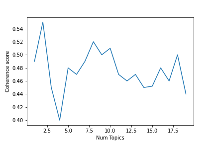
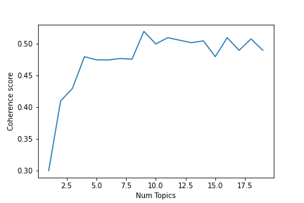

This Python script shows how the topic of e-petitions were extracted. Before approaching the topic modeling, we need to clean the texts of e-petitions.
# Text cleaning

```py
# defining the functions
import re
import string
import numpy as np
import pandas as pd
    
# Russian stopwords
# !pip install nltk
import nltk
nltk.download("stopwords")
from nltk.corpus import stopwords
russian_stopwords = stopwords.words("russian") # loading Russian stopwords
print(russian_stopwords)

def remove_stop_words(sentence):
    return ' '.join([word for word in sentence.split() if word not in russian_stopwords])

def remove_short(sentence):
    return ' '.join([word for word in sentence.split() if len(word) >= 3])
    
def remove_digits(sentence):
    return ' '.join([i for i in sentence.split() if not i.isdigit()])
    
def preprocess(all_texts):
    all_texts = list(map(lambda x: x.lower(), all_texts))#lowercase
    all_texts = list(map(lambda x: x.translate(str.maketrans('', '', string.punctuation)), all_texts))# remove punctuation
    all_texts = list(map(lambda x: x.strip(), all_texts))#remove extra spaces
    all_texts = list(map(lambda x: remove_stop_words(x), all_texts))# removing stopwords
    all_texts = list(map(lambda x: remove_digits(x), all_texts))#removing digits
    all_texts = list(map(lambda x: re.sub("[0-9]+", "", x), all_texts))#removing digits
    all_texts = list(map(lambda x: re.sub("[a-zA-Z]+", "", x), all_texts))#removing english
    all_texts = list(map(lambda x: re.sub("«", "", x), all_texts))#removing digits
    all_texts = list(map(lambda x: re.sub("»", "", x), all_texts))#removing english
    all_texts = list(map(lambda x: re.sub("  ", " ", x), all_texts))#removing english
    all_texts = list(map(lambda x: remove_short(x), all_texts))#removing short words
    return all_texts 
```
```py
# the following function creates the objects needed for the topic modeling, i.e., the corpus and id2word
#!pip3 install rnnmorph
from rnnmorph.predictor import RNNMorphPredictor
predictor = RNNMorphPredictor(language="ru")

import gensim.corpora as corpora

def create_list_of_words(all_texts):
    all_texts= preprocess(all_texts)# applying the function of preprocessing to the text
    l_text2=[]
    for doc in all_texts:
          list1=doc.split(" ")
          l_text2.append(list1)
    
    # choosing only the nouns
    corp=[]
    for j in range(0,len(l_text2)):
        if len(l_text2[j])>1:
            forms = predictor.predict(l_text2[j])
            text=[]
            for i in range(len(forms)):
                if forms[i].pos=="NOUN":
                    text.append(forms[i].normal_form)
            corp.append(text)
        else:
            corp.append([''])
    
    # Create Dictionary
    id2word = corpora.Dictionary(corp)

    # Create Corpus
    texts = corp

    # Term Document Frequency
    corpus = [id2word.doc2bow(text) for text in texts]
    
    return corp,id2word,texts,corpus
```

```py
#now, we can clean both datasets
#ROI
df_roi=pd.read_json('roi_data.json')
res1,id2word1,texts1,corpus1=create_list_of_words(df_roi.Text)

#Change.org
df_ch=pd.read_json('ch_data.json')
res2,id2word2,texts2,corpus2=create_list_of_words(df_ch.Text)
```
# Choosing the correct number of topics

To choose the correct number of topics, we need to calculate the coherance values.
```py
# defining the function
import gensim
from gensim.models import CoherenceModel
import os
from gensim.models.wrappers import LdaMallet
import time
import os
os.environ.update({'MALLET_HOME':r'C:/mallet-2.0.8/'})
mallet_path = r'C:/mallet-2.0.8/bin/mallet.bat'

#looking for the number of topics
def compute_coherence_values(dictionary, corpus, texts, limit, start=2, step=3):
    """
    Compute c_v coherence for various number of topics

    Parameters:
    ----------
    dictionary : Gensim dictionary
    corpus : Gensim corpus
    texts : List of input texts
    limit : Max num of topics

    Returns:
    -------
    model_list : List of LDA topic models
    coherence_values : Coherence values corresponding to the LDA model with respective number of topics
    """
    coherence_values = []
    
    for num_topics in range(start, limit, step):
        print(num_topics)
        start=time.time()
        model = gensim.models.wrappers.LdaMallet(mallet_path, corpus=corpus, num_topics=num_topics, id2word=id2word)
        coherencemodel = CoherenceModel(model=model, texts=texts, dictionary=dictionary, coherence='c_v')
        end=time.time()
        coherence_values.append(coherencemodel.get_coherence())

    return coherence_values

#defining the function to build the graph of the coherence values
import matplotlib.pyplot as plt

def get_coh_v(id2word, corpus, texts, start, limit, step):
    # Getting the coherence numbers 
    
    #running the function
    coherence_value = compute_coherence_values(dictionary=id2word, corpus=corpus, texts=texts, start=start, limit=limit, step=step)
   
    
    # building the graph 
    x = range(start, limit, step)
    plt.plot(x, coherence_value)
    plt.xlabel("Num Topics")
    plt.ylabel("Coherence score")
    plt.legend(("coherence_values"), loc='best')
    
    plt.show()
```
```py
#running the function
get_coh_v(id2word1,corpus1,texts1,1,20,1)
get_coh_v(id2word2,corpus2,texts2,1,20,1)
```



# Topic modeling

Once we found the correct number of topics to be extracted, we can conduct LdaMallet topic modeling.
```py
#defining the function to extract topics
def get_model_results(corpus,id2word):
    print('Enter the number of topics')
    x = int(input())
    model = gensim.models.wrappers.LdaMallet(mallet_path, corpus=corpus, num_topics=x, id2word=id2word)
    
    # Creating a df of topic words
    import pandas as pd
    topics = [[(term, round(wt, 3)) for term, wt in model.show_topic(n, topn=20)] for n in range(0, model.num_topics)]
    topics_df = pd.DataFrame([[term for term, wt in topic] for topic in topics], columns = ['Term'+str(i) for i in range(1, 21)], index=['Topic '+str(t) for t in range(1, model.num_topics+1)]).T
    topic_list=[]
    print("Give a title for the following topic")
    for item in range(0,x):
        print(list(topics_df.iloc[:,item]))
        y=input()
        topic_list.append(y)
    topics_df.columns =topic_list
    # Get the results 
    tm_results = model[corpus]
    df_new=pd.DataFrame(tm_results)
    for item in range(0,x):
        list1=df_new[item]
        new_list = list(map(lambda x: x[1], list1))
        df_new.loc[:,item]=new_list
    df_new.columns =topic_list
    df_new['main_topic']=df_new.idxmax(axis=1)
    
    return(df_new,topics_df)
```
The function allows to specify the number of topic and name categories one by one.
```py 
result_df1,top1=get_model_results(corpus1,id2word1)#the specified number of topics is 5
result_df2,top2=get_model_results(corpus2,id2word2)#the specified number of topics is 9
```
Now, we can attach the main topic column to the datasets and save the dfs.
```py 
df_roi['main_topic']=result_df1['main_topic']
df_ch['main_topic']=result_df2['main_topic']

df_roi.to_csv('df_roi.csv',encoding='utf-8-sig')
df_ch.to_csv('df_ch.csv',encoding='utf-8-sig')
```
We can also check if some words are missing in the ROI documents.
```py
all_words1=texts1
all_words2=texts2
all_words_list1 = [item for item2 in all_words1 for item in item2]
all_words_list2 = [item for item2 in all_words2 for item in item2]

diff_words=np.setdiff1d(all_words_list2,all_words_list1).tolist()
word_in_doc=[]
for i in diff_words:
    n_doc=0
    for j in all_words2:
        if i in j:
            n_doc+=1
    word_in_doc.append(n_doc)
d = {'Word':diff_words,'In N documents':word_in_doc}
wk= pd.DataFrame(d)
wk=wk.sort_values(by=['In N documents'], ascending=False)
```
